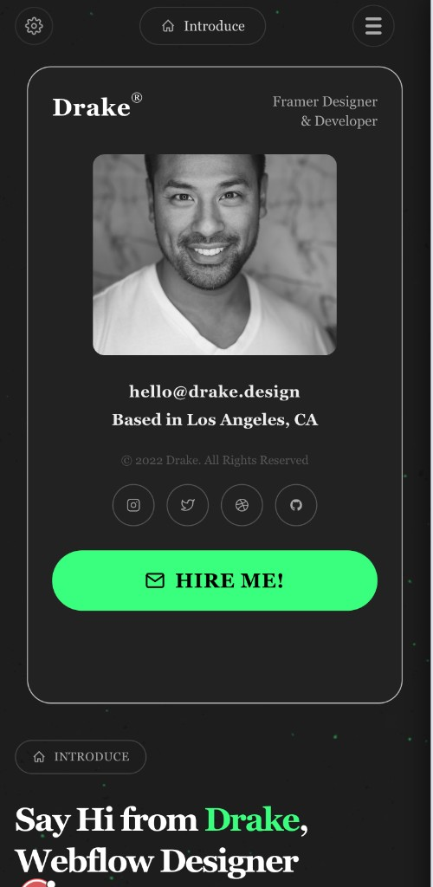
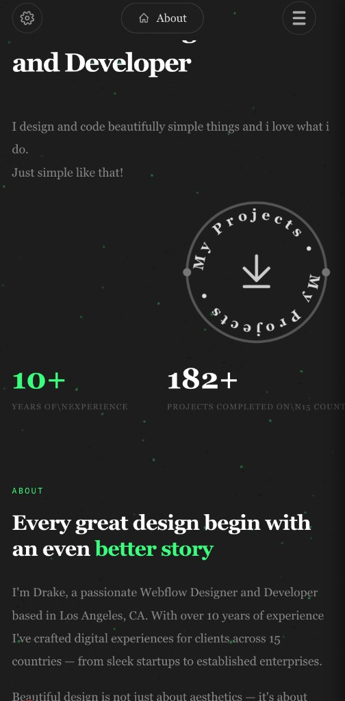
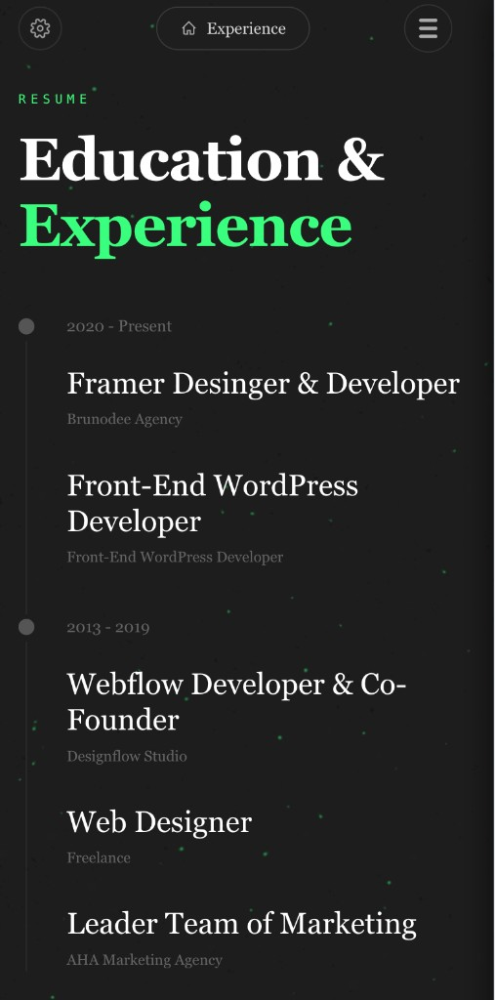
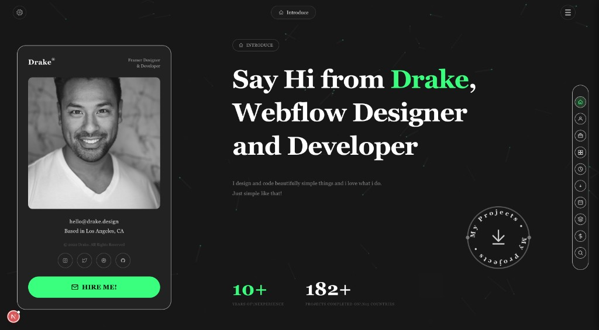
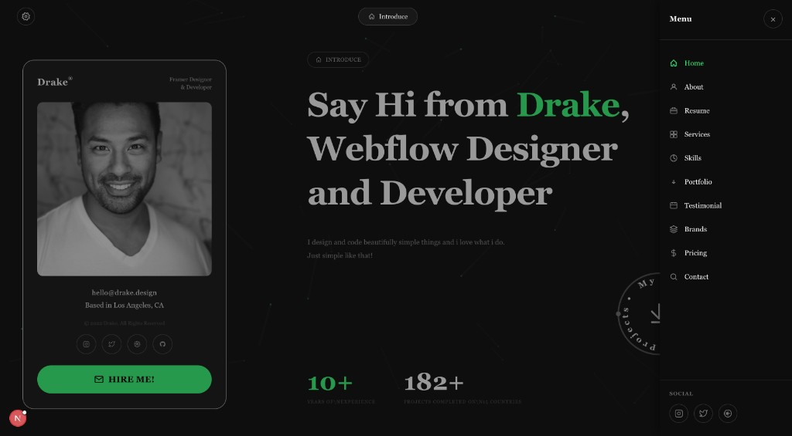
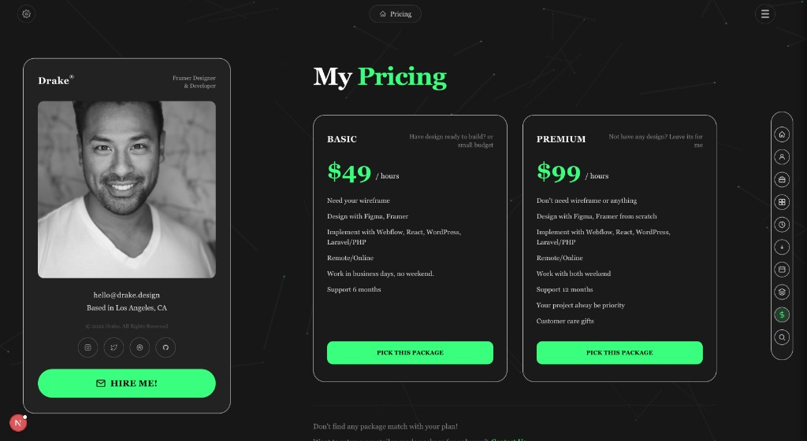

# Drake Portfolio — Design Documentation

This document describes the design system, layout, and UI patterns for the **Drake Portfolio** project. All screenshots are stored in `public/design-docs/` so they render correctly when the repo is viewed on GitHub.

---

## Overview

A dark-themed, responsive portfolio for **Drake** (Framer Designer & Developer) with a particle background, sticky profile card, and section-based layout. Built with Next.js, Tailwind CSS, and Three.js for the background effect.

---

## Design Principles

- **Dark-first:** Charcoal/black background (`#222`, `#111`) with high contrast for text and CTAs.
- **Accent color:** Vibrant green (`#39FF7E`) for headings, stats, active states, and primary buttons.
- **Typography:** Sans-serif, bold headings; lighter weights for body and secondary text. Responsive type scale (larger on desktop, tuned for mobile).
- **Motion:** Subtle particle field (BeeEffect), fade-in cards, and smooth scroll/navigation.

---

## Color Palette

| Role        | Value     | Usage                          |
|------------|-----------|---------------------------------|
| Accent     | `#39FF7E` | CTAs, highlights, active nav    |
| Background | `#111` / `#222` | Page and card backgrounds   |
| Card border| `#c4c4c4` / `#444` | Cards, pills, inputs     |
| Primary text | `#fff` / `#eee` | Headings, key copy      |
| Secondary  | `#aaa` / `#888` | Labels, descriptions        |
| Muted      | `#555`    | Copyright, fine print          |

---

## Layout

### Desktop (≥1024px)

- **Three columns:** Profile card (left, fixed width) | Main content (center, flexible) | Right nav (vertical pill with section icons).
- **Profile card:** ~480px wide, min height 720px, square profile image, contact info, social icons, “HIRE ME!” button.
- **Sections:** Introduce, About, Experience, Services, Skills, Projects, Clients, Brands, Pricing, Contact — each with an id for scroll/spy.

### Mobile (<1024px)

- **Single column:** Top bar (settings, current-section pill, hamburger) → Profile card (compact, reduced image height, larger/bolder text) → Sections stacked vertically.
- **Navigation:** Hamburger opens a slide-in sidebar (right) with nav links and social; no right-edge pill on mobile.
- **Profile card:** First in scroll order, `min-h 68vh`, square image with max height 200px; email, location, copyright, and “HIRE ME!” with increased font size and weight.

---

## Key Components

| Component         | Role                                                                 |
|------------------|----------------------------------------------------------------------|
| **TopBar**       | Settings icon, section pill (e.g. “Introduce”), hamburger menu     |
| **ProfileCard**  | Drake® header, tagline, profile image, email, location, copyright, social row, “HIRE ME!” |
| **IntroduceSection** | INTRODUCE badge, hero heading (“Say Hi from Drake…”), description, “My Projects” circle, stats (10+ years, 182+ projects) |
| **RightNav**     | Vertical icon list for section scroll (desktop only)                |
| **MobileSidebar**| Slide-in menu with nav links + icons and social (mobile/tablet)      |
| **BeeEffect**    | Full-page canvas + Three.js particle background (no bee asset)       |

---

## Screenshots

Images live in **`public/design-docs/`** so they are part of the repo and display on GitHub.

### Mobile — Profile & Introduce

Profile card first in scroll: compact layout, square image (capped height), stronger text; INTRODUCE pill and “Say Hi from Drake” below.

---

### Mobile — Intro / About

Hero line “and Developer”, body copy, “My Projects” circular CTA, stats (10+ years, 182+ projects), and start of ABOUT section with green “Every great design…” heading.

---

### Mobile — Education & Experience

RESUME label, “Education & Experience” heading, timeline (2020–Present, 2013–2019) with roles and companies. Experience pill active in top bar.

---

### Desktop — Hero

Profile card (left), main intro (center) with INTRODUCE badge, “Say Hi from Drake…”, description, “My projects” circle, stats; right vertical nav with home active.

---

### Desktop — Sidebar open

Same layout with navigation sidebar open: Menu, section links (Home, About, Resume, etc.), “My projects” circle, and social icons.

---

### Desktop — Pricing

Profile card (left), “My Pricing” section with BASIC and PREMIUM cards, pricing copy, and “PICK THIS PACKAGE” buttons; dollar icon active in right nav.

---

## Responsive Breakpoint

- **Mobile / compact:** `< 1024px` (e.g. `max-w-[1023px]` or `lg:` boundary).
- **Desktop:** `1024px` and up (`lg:` in Tailwind).

---

## Typography (summary)

- **Hero heading:** Responsive (e.g. ~26–48px mobile, 72px desktop), weight 700–800; “Drake” and selected words in accent green.
- **Section labels:** Uppercase, small, gray (e.g. INTRODUCE, ABOUT, RESUME).
- **Profile card (mobile):** Name and tagline larger/bolder; email and location `text-base font-semibold`; “HIRE ME!” `text-xl font-extrabold`.
- **Profile card (desktop):** Slightly smaller/regular weight for body text.

---

## Assets & Repo

- **Design screenshots:** `public/design-docs/*.png` — referenced in this doc so they render on GitHub.
- **Video/other:** Other assets (e.g. video) can live under `public/` as needed.

This DESIGN.md is scoped to the **Drake Portfolio** project only. The parent repo has its own main README describing the overall “free code projects for quality web design and dev” collection and how projects are added over time.
